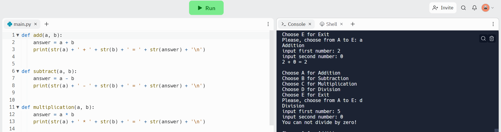

# Basic Calculator Project

A basic calculator is referred to as a 4-function calculator. It's able to do simple arithmetic, which
includes addition, subtraction, multiplication and division.

## Live Demo

You can test the calculator directly in your Web browser [here](https://replit.com/@mpopova/BasicCalculator#main.py):

