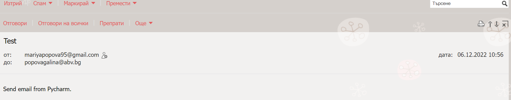

# Email Sender Project

The object of Email Sender Project is to send an email. If you want to send a confirmation email to users when they 
create an account, or send emails to members of your organization to remind them to pay their dues. Sending emails 
manually is a time-consuming and error-prone task, but it’s easy to automate with Python.

For security reasons the password is not given. To run the project, do this: 
login in your gmail account -> security -> app passwords. Then you should login
again in your gmail account. Click on select app and choose Python. It will 
generate a password, which you need for the project.
