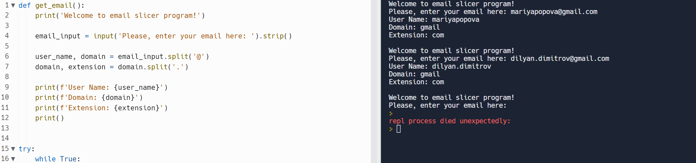

# Email Slicer Project

Email Slicer is a simple tool where the email address is provided as an input and as an output, the application returns
the username, the domain and the extension of the email address given.

## Live Demo

You can test the program directly in your Web browser [here](https://replit.com/@mpopova/EmailSlicer#main.py).